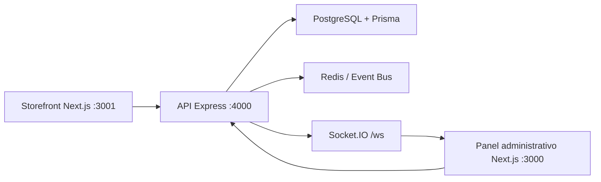
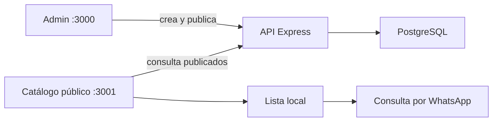

Voy a reconstruir el mapa del sistema desde sus puntos de entrada: documentación, `package.json`, API y las dos aplicaciones web. Después te explicaré el flujo completo y dónde vive cada responsabilidad.

Read 

Read 

Read 

Read 

Read 

Read 

Ya aparece la forma general: es un monorepo Turborepo con API Express, panel Next.js y una tienda Next.js separada; PostgreSQL/Prisma guarda el estado y Redis/WebSocket comunica eventos. Ahora voy a contrastar esa documentación con el código real, especialmente autenticación, cliente HTTP, esquema de datos y la diferencia entre `web` y `storefront`.

Read 

Read 

Read 

Read 

Read 

Read 

Read 

Read 

Read 

Read 

Read 

Read 

Read 

Read 

Read 

La implementación confirma un detalle importante: `web` es el panel administrativo y proxifica `/api/*` hacia Express; `storefront` es otra app para catálogo público, pero comparte la misma API de productos. La protección no depende solo del middleware de Next: el backend vuelve a validar el JWT y el rol `ADMIN`, que es la barrera real para operaciones administrativas. Me falta revisar el catálogo público y los eventos para cerrar el recorrido de datos.

Read 

Read 

Read 

Read 

Read 

Read 

Read 

Read 

Read 

Read 

Read 

Read 

Read 

**Resumen**

Es una plataforma para **Adornos Remático Villavicencio**, organizada como monorepo:



**1. Aplicaciones**

- `web`: panel administrativo.
  - Login
  - Dashboard de pagos
  - Verificaciones
  - Gestión de productos
  - Configuración y clientes

- `storefront`: catálogo público.
  - Productos publicados
  - Categorías
  - Lista de compras
  - Contacto por WhatsApp

- `api`: backend central en Express.
  - Autenticación
  - Pagos
  - Productos
  - Verificaciones
  - Subida de imágenes
  - Auditoría

Los dos frontends redirigen sus llamadas `/api/*` al backend mediante la configuración de Next.js, por ejemplo en `next.config.js`.

**2. Backend**

El punto de entrada es `index.ts`. Allí se crea el servidor HTTP, se monta Express y se activa Socket.IO.

Las rutas se registran en `app.ts`:

- `/api/auth`: login, registro, refresh y usuario actual.
- `/api/payments`: pagos y estadísticas.
- `/api/verifications`: verificación manual de pagos.
- `/api/products`: catálogo público y administración de productos.
- `/api/simulator`: simulación de pagos.
- `/api/settings` y `/api/audit`: configuración y trazabilidad.

**3. Autenticación**

El flujo es:

1. El usuario inicia sesión desde `web`.
2. La API verifica el correo y la contraseña con bcrypt.
3. Devuelve un `accessToken` de corta duración y un `refreshToken`.
4. El frontend guarda ambos en `localStorage`.
5. Cada petición protegida envía:

```http
Authorization: Bearer <accessToken>
```

6. Si el access token expira, `api.ts` solicita tokens nuevos automáticamente.
7. El backend valida el token en `auth.ts`.
8. Las operaciones de productos administrativos exigen además el rol `ADMIN`.

**4. Base de datos**

Prisma conecta PostgreSQL. El modelo principal está en `schema.prisma`.

Entidades importantes:

- `User`: usuarios y roles `ADMIN`/`USER`.
- `Payment`: pagos recibidos.
- `PaymentVerification`: comprobaciones manuales de pagos.
- `Product`, `Category`: catálogo.
- `ProductImage`: imágenes de productos.
- `ProductOption`, `OptionValue`, `ProductVariant`: colores, tamaños y variantes.
- `AuditLog`: historial de acciones.
- `Setting`: configuración global.

**5. Flujo de un pago**

Cuando llega un pago:

1. `PaymentService.receivePayment()` lo guarda en PostgreSQL.
2. Publica eventos como `PaymentReceived` y `PaymentSaved`.
3. Registra una auditoría.
4. Solicita un anuncio de voz.
5. Socket.IO transmite el pago al dashboard conectado.

La lógica está en `payment-service.ts`, y la comunicación en tiempo real en `index.ts`.

Redis permite publicar eventos entre procesos. El código está en `publisher.ts`.

**6. Flujo del catálogo**

El administrador crea un producto desde `web`:

```text
Panel admin
  -> POST /api/products
  -> Express valida con Zod
  -> Prisma guarda producto, imágenes y opciones
  -> PostgreSQL
```

El storefront consulta únicamente productos con estado `PUBLISHED`:

```text
Storefront
  -> GET /api/products
  -> API filtra status = PUBLISHED
  -> PostgreSQL
  -> Catálogo público
```

La implementación está en `index.ts`.

**7. Infraestructura**

`docker-compose.yml` levanta:

- PostgreSQL en `5432`
- Redis en `6379`
- API en `4000`
- Web admin en `3000`
- Storefront en `3001`
- Nginx como proxy en `80/443`

Los comandos principales están definidos en `package.json`:

```bash
npm install
npm run db:generate
npm run db:push
npm run dev
```

Para entenderlo en orden, te recomiendo leer:

1. `README.md`
2. `ARCHITECTURE.md`
3. `app.ts`
4. `schema.prisma`
5. `api.ts`
6. `index.ts`

Voy a seguir el recorrido real del panel: entrada, layout, login, protección de páginas y una pantalla administrativa que consuma la API. Así te explico qué ocurre desde que entras hasta que una acción llega al backend.

Read 

Read 

Read 

Read 

El código actual del panel es más pequeño que lo que describe el README: la navegación visible del admin solo enlaza `Productos` y `Publicidad IA`, y no existe la página `admin/dashboard` en el árbol actual. Voy a comprobar cómo se protege y ejecuta la publicidad para distinguir claramente la interfaz de la seguridad del backend.

Read 

Read , lines 1 to 280

Read , lines 1 to 320

El **admin** es la aplicación `web`, ejecutándose normalmente en:

```text
http://localhost:3000
```

Su objetivo actual es administrar el catálogo y crear publicidad.

**Entrada al panel**

1. Entras a `/login`.
2. Escribes correo y contraseña.
3. El frontend llama a:

```http
POST /api/auth/login
```

4. La API busca el usuario en PostgreSQL, compara la contraseña con bcrypt y devuelve:
   - `accessToken`
   - `refreshToken`
   - datos del usuario

El formulario está en `page.tsx` y la lógica de autenticación en `auth.tsx`.

Después del login:

```text
/login
  -> guarda tokens en localStorage y cookies
  -> /admin/products
```

**Estructura visual**

El layout general está en `layout.tsx`.

Actualmente el menú muestra:

- `Publicidad IA`
- `Productos`

También muestra el usuario conectado y permite cerrar sesión.

Al cerrar sesión se eliminan los tokens y se vuelve a `/login`.

**Protección**

Hay dos niveles:

1. **Frontend:** el middleware revisa si existe un token antes de permitir ciertas rutas.
2. **Backend:** Express verifica realmente el JWT y, para las operaciones administrativas, exige el rol `ADMIN`.

La validación principal está en `auth.ts`.

El frontend no debe considerarse la seguridad definitiva; aunque alguien acceda directamente a una URL, el backend debe rechazar las operaciones sin permisos.

**Administrar productos**

La página está en `page.tsx`.

Al cargarla:

```text
ProductosPage
  -> fetchAdminProducts()
  -> GET /api/products/admin/list
  -> API valida JWT + rol ADMIN
  -> Prisma consulta PostgreSQL
  -> lista de productos
```

Desde ahí el administrador puede:

- Crear productos.
- Editar nombre, descripción, unidad y categoría.
- Publicar o despublicar.
- Eliminar productos.
- Subir imágenes.
- Reordenar imágenes.
- Crear atributos como `Color` o `Tamaño`.
- Agregar valores a esos atributos.
- Marcar productos como destacados.

El formulario detallado está en `ProductForm.tsx`.

Por ejemplo, al crear un producto:

```text
Formulario
  -> sube imágenes si existen
  -> POST /api/products
  -> API valida datos con Zod
  -> Prisma guarda producto e imágenes
  -> PostgreSQL
```

Un producto solo aparece en la tienda pública cuando tiene estado `PUBLISHED`.

**Publicidad IA**

La pantalla está en `page.tsx`.

El flujo es:

```text
1. Seleccionar imagen
2. Convertirla a base64
3. Solicitar eliminación de fondo
4. Elegir estilo y formato
5. Enviar datos al generador
6. Componer la imagen final
7. Descargar el resultado
```

Llamadas principales:

```http
POST /api/publicidad/remover-fondo
POST /api/publicidad/generar
```

La interfaz maneja los estados:

- `upload`
- `configure`
- `generating`
- `result`

También existe una vista de historial de imágenes generadas.

**Dónde están las llamadas al backend**

La mayoría de las funciones del panel están centralizadas en `api.ts`.

Ese archivo:

- Agrega automáticamente el JWT.
- Ejecuta `fetch`.
- Intercepta respuestas `401`.
- Renueva el token usando el `refreshToken`.
- Reintenta la petición original.
- Redirige al login si la sesión expiró.

**Importante sobre el estado actual**

El README menciona dashboard, pagos y verificaciones dentro del panel, pero en el árbol actual del admin solo aparecen estas páginas:

- `products`
- `publicidad-ia`
- `customers`
- `settings`
- `components`

No aparece actualmente `apps/web/app/admin/dashboard/page.tsx`, ni esos enlaces están en el menú principal. Por eso conviene tomar el código actual como referencia principal y el README como documentación posiblemente desactualizada.

Voy a seguir el catálogo de extremo a extremo: cómo el admin guarda productos, cómo la API decide cuáles son públicos y cómo el storefront los muestra y filtra. También verificaré cómo funcionan las imágenes, atributos y la lista de compras.

Read 

Read 

Read 

Read 

Read 

El recorrido público ya está claro: no es una tienda con carrito ni precios; es un catálogo de consulta. El usuario filtra productos, entra al detalle, elige atributos y arma una lista local que finalmente se envía por WhatsApp. Voy a revisar el contexto de esa lista para explicar dónde se guarda y cómo se identifica cada selección.

Read 

Read 

Read 

Read , lines 1 to 110

El catálogo funciona como una **vitrina pública**, no como una tienda con pagos. Los clientes consultan productos y envían una solicitud por WhatsApp.



**1. El administrador crea el producto**

Desde `web`, en `page.tsx`, el administrador puede:

- Crear categorías.
- Crear productos.
- Añadir descripción y detalles.
- Elegir unidad de venta: unidad, metro, kilo, docena, etc.
- Subir imágenes.
- Crear atributos como `Color`, `Tamaño` o `Material`.
- Añadir valores a cada atributo.
- Marcar el producto como destacado.
- Cambiar su estado.

El formulario está en `ProductForm.tsx`.

Antes de guardar imágenes, el admin las sube mediante:

```http
POST /api/upload
```

La API almacena los archivos en `uploads` y devuelve URLs públicas.

**2. La API guarda el producto**

La lógica está en `index.ts`.

Al crear un producto:

```text
Formulario admin
  -> POST /api/products
  -> JWT + rol ADMIN
  -> Validación con Zod
  -> Prisma
  -> PostgreSQL
```

La API genera un `slug` a partir del nombre. Por ejemplo:

```text
"Globos Metalizados Dorados"
  -> "globos-metalizados-dorados"
```

El producto se guarda junto con:

- Categoría.
- Imágenes.
- Opciones.
- Valores de opciones.
- Variantes, si se crean mediante la API.

Los modelos están definidos en `schema.prisma`.

**3. El estado controla la visibilidad**

Cada producto tiene uno de estos estados:

```text
DRAFT        Borrador
PUBLISHED    Publicado
UNAVAILABLE  No disponible
ARCHIVED     Archivado
```

Solo los productos con estado `PUBLISHED` aparecen en el catálogo público.

La API aplica este filtro:

```ts
where: {
  status: "PUBLISHED"
}
```

Por eso un producto creado como `DRAFT` queda visible para el admin, pero no para los visitantes.

**4. El storefront carga el catálogo**

La tienda pública está en `storefront` y normalmente corre en:

```text
http://localhost:3001
```

La página principal del catálogo está en apps/storefront/app/(shop)/products/page.tsx/products/page.tsx).

Al abrirla hace dos consultas:

```http
GET /api/products/categories
GET /api/products
```

La segunda consulta devuelve productos publicados y puede incluir filtros:

```http
GET /api/products?category=globos
GET /api/products?search=dorado
GET /api/products?option=Color&optionValue=rojo
```

La API permite filtrar por:

- Categoría.
- Nombre o descripción.
- Atributo.
- Valor del atributo.

Los productos destacados aparecen primero y luego se ordenan por fecha de creación.

**5. La tarjeta del producto**

En el listado público cada tarjeta muestra:

- Imagen principal.
- Categoría.
- Nombre.
- Descripción.
- Atributos disponibles.
- Enlace a los detalles.
- Botón para agregarlo a la lista.

El catálogo no muestra precios porque el modelo `Product` no tiene un campo de precio. La finalidad actual es consultar disponibilidad.

**6. Página de detalle**

Al seleccionar un producto, se abre:

```text
/products/{slug}
```

Por ejemplo:

```text
/products/globos-metalizados-dorados
```

La página está en [apps/storefront/app/(shop)/products/[slug]/page.tsx](apps/storefront/app/(shop)/products/[slug]/page.tsx).

Hace esta petición:

```http
GET /api/products/globos-metalizados-dorados
```

Muestra:

- Galería de imágenes.
- Imágenes asociadas a atributos.
- Nombre.
- Categoría.
- Unidad de venta.
- Descripción.
- Detalles adicionales.
- Opciones como color o tamaño.
- Botón para agregar a la lista.
- Contacto por WhatsApp.

Si el producto no está publicado o no existe, la API devuelve `404` y la página muestra “Producto no encontrado”.

**7. Atributos e imágenes**

Un producto puede tener opciones:

```text
Color:
  - Rojo
  - Azul
  - Dorado

Tamaño:
  - Pequeño
  - Grande
```

Cada valor puede tener su propia imagen. Cuando el usuario selecciona, por ejemplo, `Azul`, la página puede cambiar automáticamente la imagen mostrada.

La selección se guarda en memoria como:

```ts
{
  Color: "Azul",
  Tamaño: "Grande"
}
```

Aunque la base de datos también tiene `ProductVariant`, la interfaz actual trabaja principalmente con `ProductOption` y `OptionValue`.

**8. Mi lista**

El catálogo no crea pedidos directamente. Al pulsar “Agregar a mi lista”, se abre apps/storefront/app/(shop)/components/AddToListModal.tsx/components/AddToListModal.tsx).

El usuario selecciona:

- Atributos.
- Cantidad.
- Unidad de venta.

La lista se guarda en el navegador usando `localStorage`, mediante `shopping-list-context.tsx`.

Eso significa que:

- No se guarda en PostgreSQL.
- No requiere iniciar sesión.
- Es propia de cada navegador.
- Puede sobrevivir al cierre de la página.
- Se pierde si se borra el almacenamiento del navegador.

**9. Envío por WhatsApp**

La página apps/storefront/app/(shop)/shopping-list/page.tsx/shopping-list/page.tsx) permite:

- Cambiar cantidades.
- Eliminar productos.
- Vaciar la lista.
- Revisar atributos seleccionados.
- Enviar la solicitud por WhatsApp.

El sistema genera un mensaje parecido a:

```text
Hola, me interesa consultar disponibilidad de los siguientes productos:

- Globos dorados (Color: Dorado): 2 paquetes
- Cintas rojas (Material: Satinada): 5 metros

Gracias!
```

Después abre un enlace `wa.me` con el mensaje precargado.

**Resumen del flujo completo**

```text
Admin crea producto
  -> producto queda DRAFT
  -> admin lo publica
  -> estado cambia a PUBLISHED
  -> aparece en GET /api/products
  -> cliente lo filtra o busca
  -> abre el detalle
  -> selecciona atributos y cantidad
  -> lo guarda en localStorage
  -> envía la lista por WhatsApp
```

En otras palabras: actualmente el catálogo sirve para **mostrar inventario disponible y recibir solicitudes de compra por WhatsApp**, pero todavía no gestiona precios, carrito real, pedidos ni pagos dentro de la aplicación.